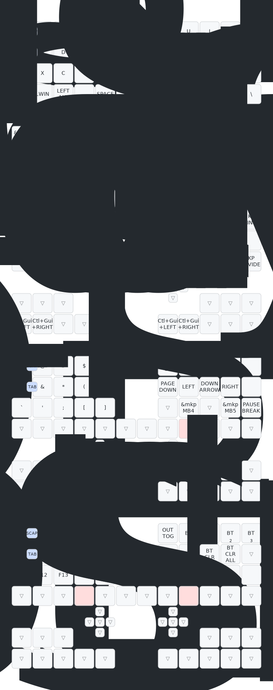

# zmk-config-LalaPadGen2_v1

LalaPad Gen2 用の ZMK 設定。

## キーマップ

下の図は `config/lalapadgen2.keymap` から [keymap-drawer](https://github.com/caksoylar/keymap-drawer) で自動生成されます。
keymap を編集して push すると、GitHub Actions（`.github/workflows/draw.yml`）が走り、最新の図に自動更新されます。

> 図がまだ表示されない場合は、一度 keymap を push するか、Actions タブの「Draw keymap」ワークフローを手動実行（Run workflow）してください。

### 仕組み

- `config/lalapadgen2.json` … keymap editor が出力する物理レイアウト。
- `keymap_drawer_layout.json` … それを keymap-drawer 用（QMK info.json 形式）に変換したもの。
- 物理レイアウトを変えたときは `keymap_drawer_layout.json` も作り直してください。
